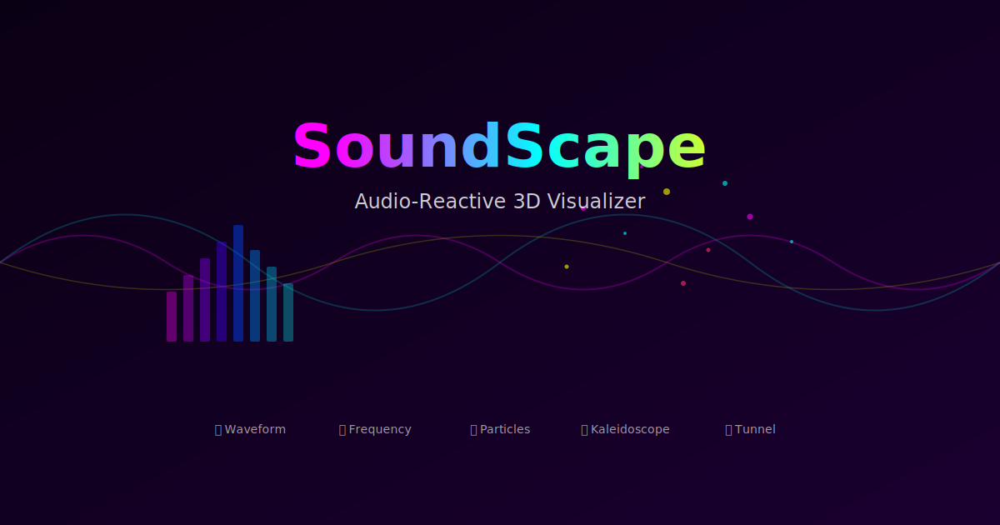

# 🎵 SoundScape — Audio-Reactive 3D Visualizer

A real-time audio-reactive 3D visualizer built with React, Three.js, and the Web Audio API. Feed it your microphone or an audio file and watch sound come alive in 7 distinct visualization modes with 6 color themes.

**[🔗 Live Demo](https://kai-claw.github.io/soundscape/)**



## ✨ Features

### 7 Visualization Modes

| # | Mode | Description |
|---|------|-------------|
| 1 | 🌊 **Waveform Ribbon** | Custom GLSL vertex+fragment shader, 128-segment flowing ribbon |
| 2 | 📊 **Frequency Bars** | 16×16 InstancedMesh grid (256 bars), height + color mapped to FFT |
| 3 | ✨ **Particle Field** | 3,000 particles with custom shader, additive blending |
| 4 | 🔮 **Kaleidoscope** | 8-fold mirrored geometry, 6 shape types (48 meshes) |
| 5 | 🕳️ **Tunnel** | 30 wireframe torus rings, depth-scrolling, bass-reactive pulse |
| 6 | 🏔️ **Waterfall** | 3D scrolling spectrogram terrain — sound history as landscape |
| 7 | 🔥 **Flame** | Procedural GLSL aurora fire with simplex noise + FBM |

### 6 Color Themes
- 💜 **Neon** — Magenta / Cyan / Yellow
- 🌅 **Sunset** — Orange / Red / Gold
- 🌊 **Ocean** — Blue / Teal / Sky
- ⚪ **Monochrome** — Clean black & white
- ❄️ **Arctic** — Icy blues / whites / frost
- 🌲 **Forest** — Deep emerald / lime / earth

### Audio Engine
- **Web Audio API** with 2048-point FFT analysis
- **Microphone input** (real-time) or **file upload** (MP3, WAV, FLAC, OGG, etc.)
- **BPM detection** via onset analysis with dynamic thresholding
- **Auto-gain normalization** — quiet tracks feel as punchy as loud ones
- **Smooth audio processing** — 8-band spectral analysis with asymmetric attack/release
- **Band separation** — bass, mid, high frequency isolation

### Experience Layers (stackable effects)
- 🎬 **Cinematic** — Auto-cycles through all 7 modes with smooth transitions
- ✦ **Starfield** — 800 audio-reactive stars with bass drift + high-freq twinkle
- ◎ **Orbit Ring** — Circular frequency mandala, dual-ring with spectrum color mapping
- 💓 **Beat Pulse** — FOV camera pump synced to bass hits (impulse-decay model)
- 💥 **Shockwave** — Expanding torus rings triggered by strong bass onsets

### 8 Curated Presets
One-click combos that showcase the best feature combinations:
- 🧘 **Zen** — Calm ocean waves + gentle starfield
- 🎉 **Rave** — Full neon chaos, everything cranked up
- 🌌 **Ambient** — Dreamy particles + orbit ring
- 🔥 **Inferno** — Blazing flame + beat shockwaves
- 🎬 **Cinema** — Auto-cycling modes + full effects
- ◻️ **Minimal** — Clean monochrome frequency bars
- ❄️ **Frozen** — Icy particles + arctic starfield
- 🌿 **Jungle** — Deep forest tunnel + beat pulse

### Sharing & Screenshots
- **URL state encoding** — share your exact configuration via URL hash
- **Native share dialog** on mobile, clipboard fallback on desktop
- **Screenshot capture** — download PNG snapshots of the visualization
- **URL auto-sync** — URL updates as you change settings

### Accessibility
- Full **ARIA** attributes on all controls
- **Skip links** for keyboard navigation
- **Reduced motion** support (`prefers-reduced-motion`)
- **Screen reader** announcements for mode/theme changes
- **Focus management** with visible outlines
- **Tab order** for all interactive elements

### UI / UX
- **Collapsible control panel** (P key) for immersive viewing
- **Mini spectrum analyzer** in control panel
- **FPS counter** toggle
- **Help overlay** (H key) with all keyboard shortcuts
- **Touch support** with swipe gesture handling
- **WebGL context loss** recovery with user notification
- **File error handling** with auto-dismissing notifications
- **Audio context resume** on tab visibility change

## ⌨️ Keyboard Shortcuts

| Key | Action |
|-----|--------|
| 1-7 | Switch visualization mode |
| ← → | Cycle modes |
| T | Cycle theme |
| Space | Play / Pause |
| C | Toggle cinematic autoplay |
| S | Toggle starfield |
| O | Toggle orbit ring |
| B | Toggle beat pulse |
| W | Toggle shockwave |
| P | Collapse / expand panel |
| G | Toggle auto-gain |
| F | Toggle fullscreen |
| H | Show help overlay |

## 🛠️ Tech Stack

- **React 19** + **TypeScript**
- **Three.js** / **React Three Fiber** / **drei**
- **Web Audio API** (AnalyserNode, MediaStream, MediaElement)
- **Custom GLSL shaders** (vertex + fragment for Waveform, Particles, Flame, Starfield, Waterfall)
- **Zustand** state management
- **Vite** build tooling
- **Vitest** testing (417 tests across 10 suites)

### Emotional Quality (Pass 5)
- 🎭 **Mood Text** — evocative phrases bloom during mode transitions ("dissolve into light", "the bass pulls you forward")
- 🎬 **Entrance Overlay** — cinematic threshold moment when audio first connects
- 💫 **Audio-Reactive UI** — control panel breathes with the music (bass glow, scale pulse, shimmer)
- ✨ **Atmospheric Landing** — typewriter tagline, floating dust particles, pulsing icon glow

## 📊 Build Stats

| Metric | Value |
|--------|-------|
| Total Files | 52 (41 source + 11 test/setup) |
| Total LOC | ~9,900 (4,965 source + 2,491 test + 596 CSS + config) |
| TypeScript Errors | 0 |
| Test Count | 417 (10 test suites, 6 hat passes + 4 unit) |
| Bundle (JS) | 76KB app + 494KB R3F + 719KB Three.js |
| Gzip (JS) | 24KB + 152KB + 187KB = ~363KB |
| CSS | 23.5KB (5.3KB gzip) |

## 🚀 Getting Started

```bash
# Install dependencies
npm install

# Dev server
npm run dev

# Build for production
npm run build

# Run tests
npm test

# Type check
npx tsc --noEmit
```

## 📁 Project Structure

```
src/
├── audio/           # Audio engine, BPM detection, smooth processing, auto-gain
├── components/      # UI: control panel, landing screen, transport, overlays
├── visualizers/     # 7 Three.js visualization modes + scene orchestrator
├── themes/          # 6 color theme definitions
├── store/           # Zustand state management + experience presets
├── utils/           # URL state encoding/decoding
├── __tests__/       # Pass-based test suites (white/black/green/yellow hat)
├── App.tsx          # Root component
└── main.tsx         # Entry point
```

## 📝 License

MIT
